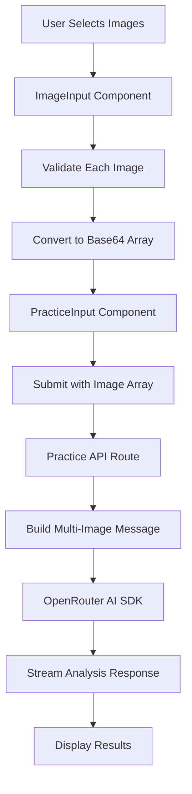

# Design Document

## Overview

This design document outlines the technical approach for implementing multi-image upload functionality and auto-detection mode for the TOEIC practice application. The solution extends the existing single-image architecture to support multiple images while maintaining backward compatibility and following the vertical slice architecture pattern.

### Key Design Goals

1. Support uploading and managing up to 5 images simultaneously
2. Change default part detection from "5" to "auto"
3. Maintain existing UI/UX patterns and component structure
4. Ensure responsive design across mobile and desktop
5. Preserve type safety and validation logic
6. Enable seamless integration with existing AI analysis pipeline

## Architecture

### Component Architecture

The solution follows vertical slice architecture with clear separation between UI components, business logic, and API layer:

```
src/features/practice/
├── components/
│   ├── image-input.tsx          (Modified: Multi-image support)
│   └── practice-input.tsx       (Modified: Handle image array)
├── hooks/
│   └── use-practice.ts          (Modified: Support multiple images)
├── types/
│   └── practice.types.ts        (Modified: Update QuestionInput type)
└── lib/
    └── schema.ts                (No changes needed)

src/app/api/practice/
└── route.ts                     (Modified: Process image array)
```

### Data Flow



## Components and Interfaces

### 1. ImageInput Component

**Purpose**: Handle multiple image selection, preview, validation, and management

**Updated Interface**:
```typescript
interface ImageInputProps {
  onImagesSelect: (images: ImageData[]) => void;
  onError: (error: string) => void;
  disabled: boolean;
  value?: ImageData[];
  maxImages?: number; // Default: 5
}

interface ImageData {
  id: string;
  file: File;
  base64: string;
  preview: string;
}
```

**Key Features**:
- Grid layout for multiple image previews (responsive: 1 col mobile, 2-3 cols desktop)
- Individual remove buttons for each image
- Drag-and-drop reordering support
- Paste support (adds to existing collection)
- File picker with multiple selection enabled
- Per-image validation with error display
- Loading states during base64 conversion
- Empty state with upload prompt

**State Management**:
```typescript
const [images, setImages] = useState<ImageData[]>([]);
const [loadingImages, setLoadingImages] = useState<Set<string>>(new Set());
```

**Validation Rules**:
- Maximum 5 images total
- Each image max 5MB
- Only JPEG/PNG formats
- Display specific error for each invalid file

### 2. PracticeInput Component

**Purpose**: Orchestrate input collection and submission

**Updated Interface**:
```typescript
interface PracticeInputProps {
  onSubmit: (input: QuestionInput) => void;
  isProcessing: boolean;
  onMessageSent?: () => void;
}
```

**Key Changes**:
- Default part selection changed from "5" to "auto"
- Handle array of images instead of single image
- Update validation logic for multiple images
- Clear all images on submit
- Display image count badge when multiple images selected

**State Management**:
```typescript
const [selectedPart, setSelectedPart] = useState<PracticePart>("auto"); // Changed default
const [images, setImages] = useState<ImageData[]>([]);
const [textContent, setTextContent] = useState("");
```

### 3. Practice Hook (use-practice.ts)

**Purpose**: Manage practice session state and API communication

**Key Changes**:
- Update `submitQuestionAsync` to handle image arrays
- Serialize multiple images in API request
- No changes to streaming logic (handled by API)

### 4. Practice API Route

**Purpose**: Process requests and communicate with AI model

**Updated Request Schema**:
```typescript
interface PracticeRequest {
  mode: "text" | "image";
  part: "5" | "6" | "7" | "auto";
  content: string | string[]; // Single string for text, array for images
  apiKey: string;
  model: string;
}
```

**Key Changes**:
- Accept `content` as either string (text mode) or string array (image mode)
- Build multi-image message format for AI SDK
- Update validation to handle array format
- Maintain backward compatibility with single image

**Multi-Image Message Format**:
```typescript
const messages = [
  {
    role: "user" as const,
    content: [
      {
        type: "text" as const,
        text: `Phân tích các câu hỏi TOEIC Part ${part} trong ${images.length} hình ảnh`,
      },
      ...images.map(img => ({
        type: "image" as const,
        image: img.startsWith("data:") ? img : `data:image/jpeg;base64,${img}`,
      })),
    ],
  },
];
```

## Data Models

### Updated QuestionInput Type

```typescript
export interface QuestionInput {
  mode: InputMode;
  part: PracticePart;
  content: string | string[]; // Text string or array of base64 images
  imageFiles?: File[]; // Array of original files if image mode
}
```

### ImageData Type (New)

```typescript
export interface ImageData {
  id: string; // Unique identifier for React keys and tracking
  file: File; // Original File object
  base64: string; // Base64 encoded string with data URI
  preview: string; // Preview URL (same as base64)
}
```

### Constants

```typescript
export const IMAGE_CONSTRAINTS = {
  MAX_COUNT: 5,
  MAX_SIZE: 5 * 1024 * 1024, // 5MB
  ALLOWED_FORMATS: ["image/jpeg", "image/png"],
} as const;
```

## Error Handling

### Validation Errors

**Image-Level Errors** (displayed per image):
- Invalid format: "Chỉ chấp nhận định dạng JPEG hoặc PNG"
- File too large: "Kích thước file không được vượt quá 5MB"
- Read error: "Không thể đọc file hình ảnh"

**Collection-Level Errors** (displayed globally):
- Too many images: "Bạn chỉ có thể tải lên tối đa 5 hình ảnh"
- No content: "Vui lòng nhập nội dung hoặc chọn hình ảnh"

### API Errors

- Missing API key: "API key là bắt buộc"
- Missing model: "Model là bắt buộc"
- Invalid image content: "Nội dung hình ảnh không hợp lệ"
- Processing error: "Không thể xử lý yêu cầu. Vui lòng thử lại"

### Error Recovery

- Individual image removal on validation failure
- Retry mechanism for failed API requests
- Clear error messages with actionable guidance
- Graceful degradation (continue with valid images)

## Testing Strategy

### Unit Tests

**ImageInput Component**:
- ✓ Validates individual image files correctly
- ✓ Rejects files exceeding size limit
- ✓ Rejects unsupported formats
- ✓ Prevents adding more than 5 images
- ✓ Converts files to base64 correctly
- ✓ Handles paste events with images
- ✓ Removes individual images from collection
- ✓ Clears all images on reset

**PracticeInput Component**:
- ✓ Defaults to "auto" part selection
- ✓ Submits multiple images correctly
- ✓ Validates empty input
- ✓ Clears images after submission
- ✓ Disables submit during processing

**Practice API Route**:
- ✓ Accepts single image (backward compatibility)
- ✓ Accepts multiple images array
- ✓ Validates image content format
- ✓ Builds correct multi-image message structure
- ✓ Returns proper error responses

### Integration Tests

- ✓ End-to-end flow: select images → submit → receive analysis
- ✓ Multi-image upload with mixed valid/invalid files
- ✓ Auto-detection mode correctly identifies parts
- ✓ Streaming response works with multiple images
- ✓ Mobile responsive behavior

### Manual Testing Checklist

- [ ] Upload 1-5 images via file picker
- [ ] Paste images from clipboard
- [ ] Drag and drop multiple images
- [ ] Remove individual images
- [ ] Reorder images (if implemented)
- [ ] Submit with multiple images
- [ ] Verify auto-detection works correctly
- [ ] Test on mobile devices
- [ ] Test with slow network
- [ ] Test error scenarios

## UI/UX Considerations

### Image Preview Grid

**Desktop Layout** (≥640px):
```
┌─────────┬─────────┬─────────┐
│ Image 1 │ Image 2 │ Image 3 │
├─────────┼─────────┼─────────┤
│ Image 4 │ Image 5 │         │
└─────────┴─────────┴─────────┘
```

**Mobile Layout** (<640px):
```
┌─────────────┐
│   Image 1   │
├─────────────┤
│   Image 2   │
├─────────────┤
│   Image 3   │
└─────────────┘
```

### Visual Feedback

- Loading spinner during base64 conversion
- Smooth fade-in animation for new images
- Hover effects on image cards
- Clear visual distinction for selected images
- Badge showing image count (e.g., "3/5 images")
- Progress indicator during upload

### Accessibility

- Proper ARIA labels for all interactive elements
- Keyboard navigation support (Tab, Enter, Delete)
- Screen reader announcements for image additions/removals
- Focus management after image removal
- Alt text for preview images

## Performance Considerations

### Optimization Strategies

1. **Lazy Base64 Conversion**: Convert images only when needed
2. **Debounced Validation**: Avoid excessive validation calls
3. **Image Compression**: Consider client-side compression for large images
4. **Parallel Processing**: Convert multiple images concurrently
5. **Memory Management**: Revoke object URLs when images are removed

### Performance Targets

- Image preview render: <100ms per image
- Base64 conversion: <500ms per image
- Total upload time: <2s for 5 images
- API response start: <1s
- Streaming analysis: Progressive display

## Migration Strategy

### Backward Compatibility

The design maintains full backward compatibility:

1. **Single Image Support**: Existing single-image flows continue to work
2. **API Compatibility**: API accepts both string and string[] for content
3. **Type Safety**: Union types ensure both formats are handled
4. **Default Behavior**: Auto mode is new default but all parts still selectable

### Rollout Plan

1. **Phase 1**: Update types and API to support arrays
2. **Phase 2**: Implement multi-image UI components
3. **Phase 3**: Update default to "auto" mode
4. **Phase 4**: Testing and refinement
5. **Phase 5**: Documentation and user communication

## Security Considerations

### Input Validation

- File type validation (whitelist approach)
- File size limits enforced client and server-side
- Base64 format validation
- Sanitize file names before display

### API Security

- API key validation
- Rate limiting (existing)
- Request size limits
- Content-type verification

### Data Privacy

- Images processed in memory only
- No server-side storage of images
- Base64 data cleared after processing
- No logging of image content

## Future Enhancements

### Potential Improvements

1. **Drag-and-Drop Reordering**: Allow users to reorder images before submission
2. **Image Cropping**: Built-in crop tool for better framing
3. **OCR Preview**: Show extracted text before submission
4. **Batch Processing**: Process multiple sets of images
5. **Image History**: Save recent uploads for quick reuse
6. **Cloud Storage**: Optional image storage for later review
7. **PDF Support**: Upload PDF pages as images
8. **Camera Integration**: Direct camera capture on mobile

### Technical Debt

- Consider using a dedicated image processing library
- Implement proper image caching strategy
- Add comprehensive error tracking
- Optimize bundle size with code splitting
